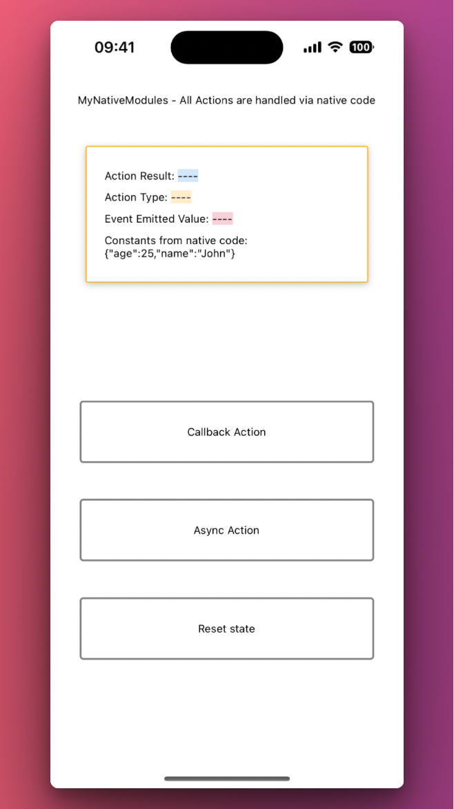

# React Native App with Native Module Integration

## Overview

This React Native application demonstrates the integration of a custom native module. It showcases handling synchronous and asynchronous actions, as well as responding to native events emitted by the module. 

The application provides a user interface to interact with these functionalities and display the results.

This app was made for learning purpose

## Features

- **Native Module Integration**: Connects with a custom native module to perform actions.
- **Event Handling**: Listens to and handles events emitted from the native module.
- **Synchronous and Asynchronous Actions**: Executes both synchronous and asynchronous functions provided by the native module.

## Setup

This is an Expo app using `expo-dev-client` for its development build, allowing for advanced native module integration.

### Prerequisites

- Ensure you have [Expo CLI](https://expo.dev/tools) installed.
- Node.js and npm (or Yarn) installed on your development machine.

### Running the App

To run this application, follow these steps:

1. Clone the repository: `git clone git@github.com:jtvargas/MyNativeModules.git`
2. Navigate to the project directory: `cd mynativemodules`
3. Install dependencies: `yarn`
4. Open Xcode (`ios/MyNativeModules.xcworkspace`) and build the project
5. Start the Expo development server:
   - Run `expo start` to start the Expo Dev Tools in the browser.
6. For running on a simulator/emulator:
   - iOS: `npm run ios` or `expo run:ios`

## Usage

The application provides three main buttons to interact with:

- **Callback Action**: Triggers a synchronous action in the native module.
- **Async Action**: Initiates an asynchronous action in the native module.
- **Reset State**: Resets the application state.

Results from these actions, as well as any events emitted by the native module, are displayed on the screen.

If you want to understand better how the code works you can read the comments added in the source code or read [this](https://medium.com/@DEV_0x07/native-modules-swift-based-the-basics-react-native-4ac2d0a712ca) medium blogpost

## Limitation
At the moment I just implemented the iOS native side, the Android part is TBD.

## Contributing

Contributions to this project are welcome. Please ensure to follow the standard pull request process and adhere to coding best practices.

